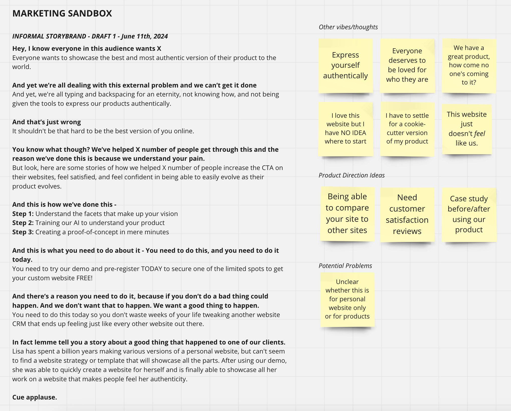

# Template Twin AI
Feed it websites you like, create a website you love

## Project Objectives
This personal project aims to explore and gain knowledge about the technology stack behind AI products. It also allows me to leverage my cross-functional expertise in product, marketing, and software engineering. Within this repository, you will find a well-documented journey that showcases my working style, process, and more.

The project will:
- Define a problem statement
- Validate the problem statement through market research
- Identify target audiences and a go-to-market strategy
- Define a technical architecture to support a public-facing proof-of-concept
- Implement a custom AI model
- Reflect on the final proof-of-concept

Check out my Miro Board [here][def5] and my ChatGPT History [here][def6] to see the journey!

## Problem Statement
I am excited to utilize the [Storybrand][def2] framework, which I discovered during my time at [Immutable][def] while spearheading the go-to-market efforts for portfolio games. This framework empowers me to communicate a clear and impactful message, connect with users, and serves as a valuable reference when developing go-to-market strategies.

## SKIPPING (for now) Market Research
SKIPPING THIS for now - but a brief Google will tell you the pain points - website templates lack SEO, scalability, UX, customization. It's a boilerplate. Tentatively thinking that my target audience is people who use website templates, but also may expand to people who use Upwork etc.

## MVP - June 13th, 2024
Current scope - 
- User puts in one to many website URLs
- User gets back ONE deployed and responsive website

The current goal is to test how bad/good we can train the AI model with minimal guidance. Since this is a learning experiment, it'd be good to have a simple goal, with very loose definition, and see how the overall results are.

## Technical Architecture - June 13, 2024
Attached my current application structure. There needs to be some discovery - 
- There seem to be existing AI models (ResNet, VGG) that will extract features from website screenshots.
-  ChatGPT (the LLM) has been my main assist in project managing my approach to this project, and it suggests I need training and validation sets, but I don't know what that means.
-  Lastly, my preliminary thoughts are that it would be useful to have the user train the model as well, not just the creator, but I'm wondering whether this would be a good user experience.
    - This question should be kept in mind when defining inputs/outputs for the various services.

## Resources
### Marketing Resources
- [Storybrand][def2]
### Product Resources

### AI Resources
- [Training Your Own AI Model Is Not As You (Probably) Think][def4]
- [How To Build AI Products That Don't Flog][def3]

[def]: https://www.immutable.com/
[def2]: https://storybrand.com/
[def3]: https://www.youtube.com/watch?v=V3uiKM2TXNY
[def4]: https://www.youtube.com/watch?v=fCUkvL0mbxI
[def5]: https://miro.com/app/board/uXjVK9fWzuk=/?share_link_id=99768542151
[def6]: https://chatgpt.com/share/4b7240d1-6e69-41a7-adcb-21e025cc6a96